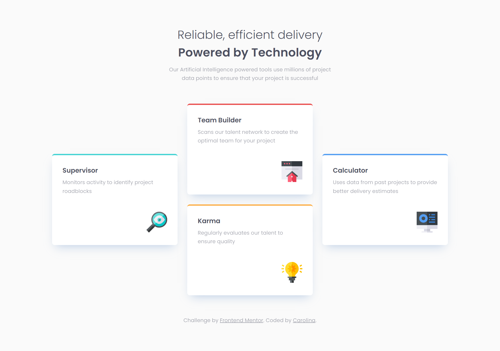
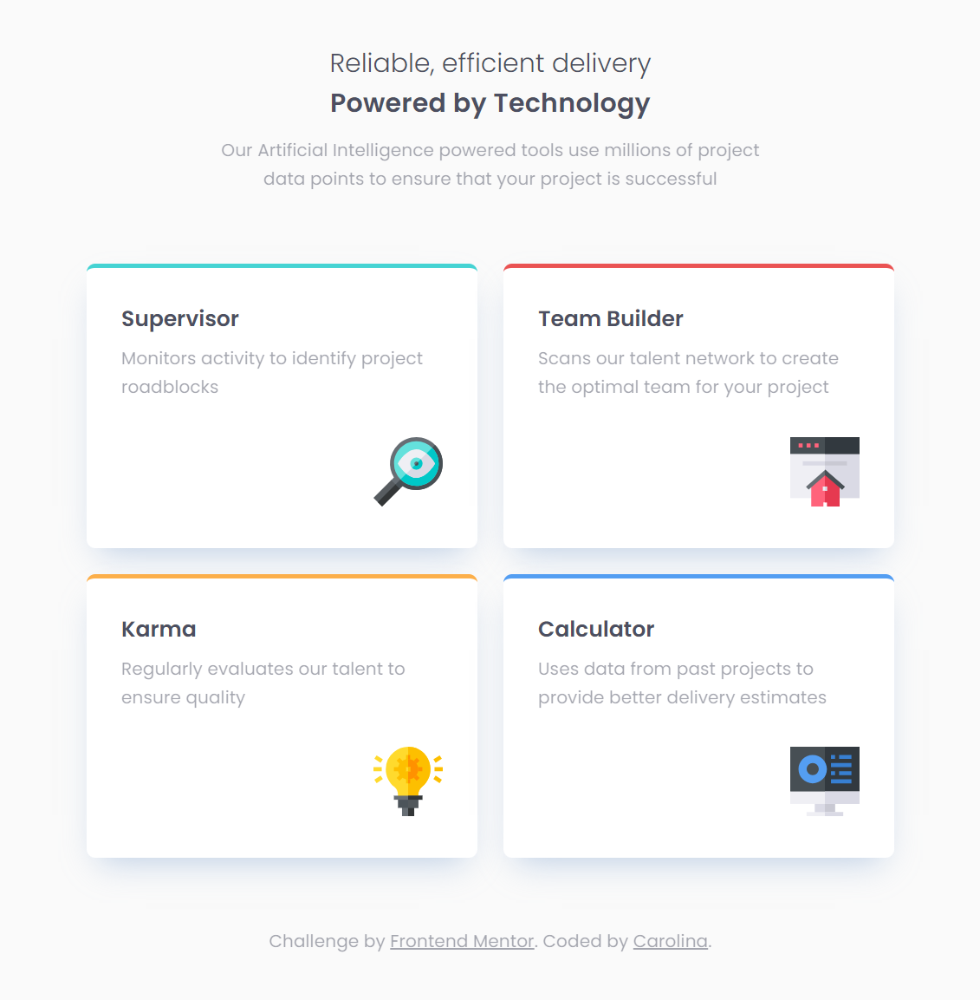
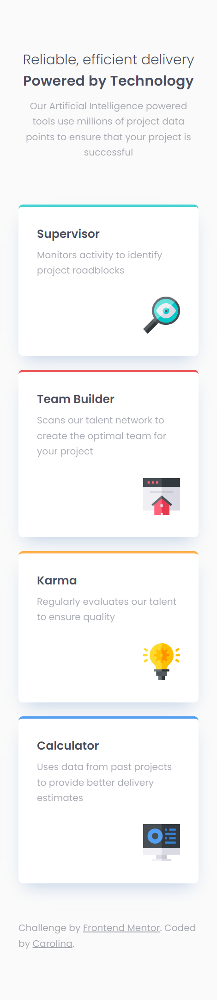

# Frontend Mentor - Four card feature section solution
This is a solution to the [Four card feature section challenge on Frontend Mentor](https://www.frontendmentor.io/challenges/four-card-feature-section-weK1eFYK). Frontend Mentor challenges help you improve your coding skills by building realistic projects. 

## Table of contents
- [Overview](#overview)
  - [The challenge](#the-challenge)
  - [Screenshots](#screenshots)
  - [Links](#links)
- [My process](#my-process)
  - [Built with](#built-with)
  - [What I learned](#what-i-learned)
  - [Useful resources](#useful-resources)
- [Author](#author)

## Overview
### The challenge
Users should be able to:

- View the optimal layout for the site depending on their device's screen size

### Screenshots
#### Desktop

#### Tablet

#### Mobile

### Links
- Solution URL: [Link](https://your-solution-url.com)
- Live Site URL: [Link](https://your-live-site-url.com)

## My process
### Built with
- Semantic HTML5 markup
- SCSS / SASS
- Flexbox
- CSS Grid

### What I learned
This challenge helped me understand how to use the CSS rule "grid-area" in a useful way. I will definitely use this rule more in future projects.

### Useful resources
- [Grid Garden](https://cssgridgarden.com/) - This helped me understand the usage of grid-area and other grid concepts.

## Author
- Github - [@carolsemeao](https://github.com/carolsemeao)
- Frontend Mentor - [@carolsemeao](https://www.frontendmentor.io/profile/carolsemeaoe)